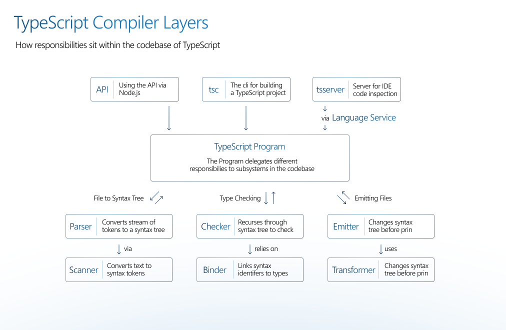

## The TypeScript Compiler

There's a lot to learn, and this document is going to try and give you a very high level overview of how the
TypeScript compiler works and how you can contribute to it.

Here are the high level sections in this docs:

- [Getting Set up](#getting-set-up)
- What is in the TypeScript repo?
- How does the compiler work?
- How does tsserver work?

## Getting Set Up

You need a modern version [of Node.js](https://nodejs.org/en/) installed and then:

- Clone the repo: `git clone https://github.com/microsoft/TypeScript`
- `cd TypeScript`
- `npm i` - installs dependencies
- `npm run gulp` - builds the TypeScript compiler
- `code .` then briefly come back to terminal to run:
- `npm test`

OK, that should have a copy of the compiler up and running and then you have tests going in the background to
prove that everything is working fine. This could take around 10m, you should see be a progress indicator.

### What happened during setup

TypeScript is built in TypeScript. The compiler uses a "last known good" version of the TypeScript to bootstrap,
you can find this version in `/lib`. The command `npm run gulp` created a copy of the compiler at `built/local`.
The corresponding version of the `tsc` compiler used in the npm package is now available via:
`node built/local/tsc.js --help`.

TypeScript has a _comprehensive_ test suite, most of the tests are high level integration tests which you can find
at `tests/cases`. Given the scope and depth of a compiler like TypeScript, we use a lot of tests to ensure
improvements don't break old requirements.

### Configuring your editor

To get your VS Code env working smoothly, set up the per-user config:

- Set up your `.vscode/launch.json` by running: `cp .vscode/launch.template.json .vscode/launch.json`
- Set up your `.vscode/settings.json` by running: `cp .vscode/settings.template.json .vscode/settings.json`

In the `launch.json` I duplicate the configuration, and change `"${fileBasenameNoExtension}",` to be whatever test
file I am currently working on.

### Learn the debugger

To test it out the debugger, open up `src/compiler/checker.ts` find
`function checkSourceFileWorker(node: SourceFile) {` and add a `debugger` statement on the first line in the
function.

```diff
function checkSourceFileWorker(node: SourceFile) {
+    debugger
    const links = getNodeLinks(node);
```

If you open up `tests/cases/fourslash/getDeclarationDiagnostics.ts` and then run your new debugging launch task
`Mocha Tests (currently opened test)`. VS Code will switch into the debugging mode and hit the debugger statement
in your TypeScript.

You'll probably want to add the following to your watch section in VS Code:

- `node.__debugKind`
- `node.__debugGetText()`
- `source.symbol.declarations[0].__debugKind`
- `target.symbol.declarations[0].__debugKind`

This is really useful for keeping track of changing state, and it's pretty often that those are the names of
things you're looking for.

## What is in the TypeScript repo?

The TypeScript repo is a single codebase which creates a set of files which are released as the "typescript" npm
module:

- `typescript.js` - The compiler API
- `tsc.js` - The command line experience for using TypeScript, which uses `typescript.js`
- `typescriptServices.js` - A web server which responds to questions about TS/JS code from editors, which uses
  `typescript.js`
- `tsserver.js` - The command line wrapper for `typescriptServices.js`

You can consider there to be three main entry points into TypeScript: Directly via `import "typescript"`, the CLI
and tsserver.



We'll be concentrating on an overview of these two parts: The TypeScript compiler and tsserver

### The TypeScript Compiler

The goal of the TypeScript compiler is to take a collection of `*.ts`/`*.js`/`*.json`/`*.d.ts` source files,
_optionally_ run a type checker over those files, and emit corresponding `*.js`/`*.d.ts`/`*.js.map` files.

Abstractly, you can think of the compiler as going through this linear process (in reality it gets a little more
complicated, but as an overview it's fine) to achieve its goal:


### TSServer
